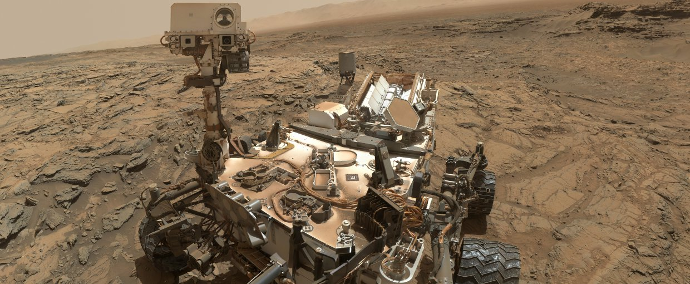

#### Background

You’re now ready to take on the full web-scraping and data analysis project for the mission to Mars. You’ve learned to identify HTML elements on a page, identify their id and class attributes, and use this knowledge to extract information via both automated browsing with Splinter and HTML parsing with Beautiful Soup. You’ve also learned to scrape various types of information. These include HTML tables and recurring elements, like multiple news articles on a webpage.

#### Technologies Used

JupyterNotebook, Visual Studio Code
,Selenium
,Beautiful Soup
,Pandas
,Json
,Splinter
,Matplotlib
,CSV

#### Objective 

As you work on this Challenge, remember that you’re strengthening the same core skills that you’ve been developing until now: collecting data, organising and storing data, analysing data, and then visually communicating your insights.

What You're Creating
This new assignment consists of two technical products. You will submit the following deliverables:

Deliverable 1: Scrape titles and preview text from Mars news articles. Optionally export the data into a JSON file or a MongoDB database.

Deliverable 2: Scrape and analyse Mars weather data, which exists in a table.

Deliverable 1: Scrape Titles and Preview Text from Mars News (40 points)
Deliverable 1 Instructions
Create a new Jupyter notebook named mars_data_challenge_part_1.ipynb.

Scrape the Mars NewsLinks to an external site. website by using Splinter and Beautiful Soup. Specifically, scrape the title and preview text, or summary text, of each article on the landing page.

If you’d like a hint on identifying which elements to scrape, that’s totally okay. If not, that’s great too. You can always revisit this later if you change your mind.

HINT
Store the scraping results in Python data structures as follows:

Store each title-and-preview pair in a Python dictionary. And, give each dictionary two keys: title and preview. An example is the following:

{'title': "Mars Rover Begins Mission!", 
      'preview': "NASA's Mars Rover begins a multiyear mission to collect data about the little-explored planet."}
Store all the dictionaries in a Python list.

Print the list in your notebook.

Optionally, store the scraped data in a file or database (to ease sharing the data with others). To do so, export the scraped data to either a JSON file or a MongoDB database.

Deliverable 1 Requirements
Automated browsing (with Splinter) was used to visit the Mars news site, and the HTML code was extracted (with Beautiful Soup). (10 points)

The titles and preview text of the news articles were scraped and extracted. (20 points)

The scraped information was stored in the specified Python data structure—specifically, a list of dictionaries. (10 points)

Deliverable 2: Scrape and Analyse Mars Weather Data (60 points)
Deliverable 2 Instructions
Create a Jupyter notebook named mars_data_challenge_part_2.ipynb. Import the relevant dependencies for web scraping, Pandas, and Matplotlib.

With your automated browser, visit the Mars Temperature DataLinks to an external site. site. Note that the URL is https://data-class-mars-challenge.s3.amazonaws.com/Mars/index.html.

Scrape the data in the HTML table. To do so, choose one of two ways. The first, simpler way is to use Pandas's read_html method. The second, slightly more challenging way is to manually scrape the data by using Splinter and Beautiful Soup. We highly encourage you to choose the latter to reinforce your scraping skills.

If you’d like a hint on manually scraping the data, that’s totally okay. If not, that’s great too. You can always revisit this later if you change your mind.

HINT
Assemble the scraped data into a Pandas DataFrame. The columns should have the same headings as the table on the website. Here’s an explanation of the column headings:

The id heading: The identification number of a single transmission from the Curiosity rover.
The terrestrial_date heading: The date on Earth.
The sol heading: The number of elapsed sols (Martian days) since Curiosity landed on Mars.
The ls heading: The solar longitude.
The month heading: The Martian month.
The min_temp heading: The minimum temperature, in Celsius, of a single Martian day (sol).
The pressure heading: The atmospheric pressure at Curiosity's location.
Examine the data types of all the DataFrame columns. If necessary, cast (or convert) the data to the appropriate datetime, int, or float data types.

If you’d like a hint on how to convert the data, that’s totally okay. If not, that’s great too. You can always revisit this later if you change your mind.

HINT
Answer the following question: How many months exist on Mars?

Answer the following question: How many Martian (and not Earth) days' worth of data exist in the scraped dataset?

Answer the following question: What are the coldest and the warmest months on Mars (at the location of Curiosity)? Get the answer by averaging the minimum daily temperature of all the months. Plot the results as a bar chart.

Answer the following question: Which months have the lowest and the highest atmospheric pressure on Mars? Get the answer by averaging the daily atmospheric pressure of all the months. Plot the results as a bar chart.

Answer the following question: About how many terrestrial (Earth) days exist in a Martian year? That is, in the time that Mars circles the Sun once, how many days elapse on Earth? Visually estimate the result by plotting the daily minimum temperature.

Export the DataFrame to a CSV file.
